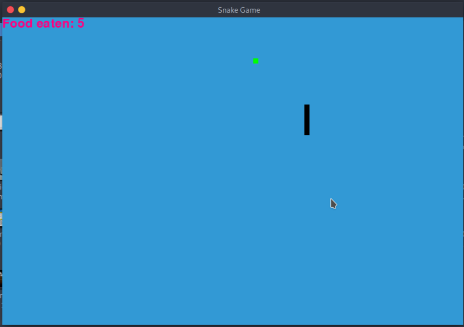

# Snake Game (GUI)

The player’s objective in the game is to achieve maximum points as possible by collecting food. The snake grows as the player eats and the player loses once the snake hits the wall or hits itself.

## Setup instructions

In order to run this script, You just need the following 3 modules

- **Pygame:** It is a set of Python modules designed for writing video games.
- **Time:** This function is used to count the number of seconds elapsed since the epoch.
- **Random:** This function is used to generate random numbers in Python by using random module. **Pygame, Time and Random**

## Screenshots

## Usage
Use arrow keys to control the snake movement

## Acknowledgements
This project was inspired by Snake game, an Arcade Maze Game which has been developed by Gremlin Industries
